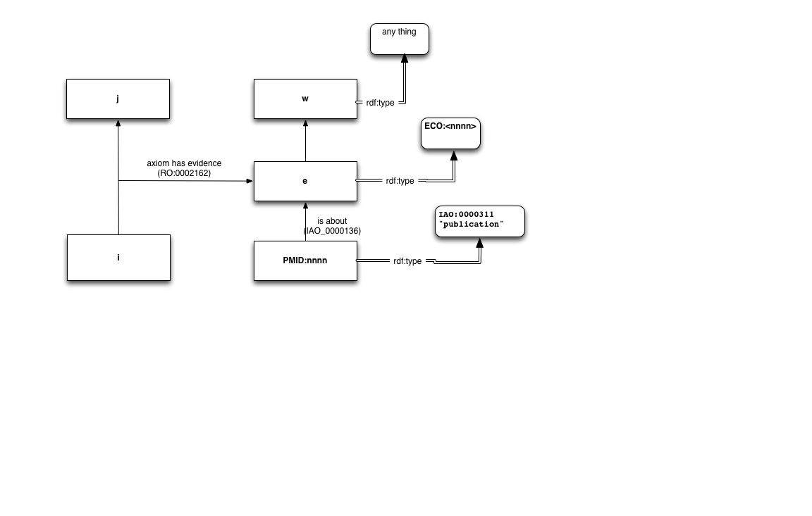

## Noctua Models in OWL

A Noctua Model (NM) is a collection of OWL ABox axioms (i.e. axioms about OWL individuals). Noctua models follow a set
of conventions for modeling biological knowledge and associated evidence.

Please read the [OWL2 Primer](http://www.w3.org/TR/owl2-primer/) and other documentation prior to this.

By convention we use OWL2 syntax - this is normative. In some cases we provide the corresponding RDF syntax - this is
informative.

Note that GO/LEGO conventions are documented here: https://github.com/geneontology/noctua-models/blob/master/README.md

### Notes on OWL2 terminology

Some OWL2 terminology can be confusing as terms may mean different things outside the description logic community. When
we use terms that appear ambiguous in this document, we always intend the OWL2 sense of the term. Please refer to the
official OWL2 documentation for clarification. Some potentially ambiguous terms include:

* `Annotation` - a tuple consisting of a property and a value
  (literal or IRI) that can be used to annotate either an object
  (Entity Annotation) or an axiom (Axiom Annotation). Annotations are non-logical (i.e. they are ignored by reasoners,
  and are intended primarily for humans). When we say Annotation, we always mean it in the OWL2 sense and never in the
  Gene Ontology sense.

* `Ontology` - any collection of OWL axioms intended to be interpreted together; in OWL, ontologies can include any mix
  of axioms about classes and axioms about individuals. Outside the DL community, the term 'ontology' is typically
  restricted to collections of *class* axioms. A Noctua model is formally an OWL Ontology that is a collection of *
  instance* axioms. To avoid confusion we use the term 'model', but it should be understood that every noctua model is
  an OWL Ontology. The model is identified via an ontology IRI, and versioned using an ontology versionIRI.

### Models

A Noctua Model is an OWL ontology that can be manipulated by Minerva

Each model can be annotated with multiple Annotations. Any annotation properties can be used, but by convention we
recommend the following:

* `dc:title` - used as the default display label for a model
* `dc:creator` - automatically added by system for the person who initiated the model
* `dc:contributor` - automatically added by system for anyone that edits

A model will typically have an Imports declaration in order to bring a relevant set of classes, object properties and
related axioms into scope. There is no constraint on what is imported, and conventions may vary by Noctua store.

### Core Axiom Types

* ClassAssertion (rdf:type) -- determines the type of a Node in the model.
* ObjectPropertyAssertion (triples, aka Facts) -- connects two nodes

These are the basic building blocks that are required for any non-degenerate model.

By convention, individuals in the model are assumed by default to have non-meaningful IRIs (e.g. UUIDs) and to lack
rdfs:label annotations. They are typically displayed to the user using the rdfs:label of the Class they instantiate.
There may be exceptions in some cases; for example, publications are modeled as individuals.

ObjectPropertyAssertions can use any OWL ObjectProperty, taken from ontologies such as RO. Particular Noctua deployments
may be configured with different lists, see below.

### Class Constructs

* SomeValuesFrom
* IntersectionOf
* UnionOf

These are typically used to construct a class expression for use in a ClassAssertion. Additional constructs from the
OWL2 spec can be added, but this requires extension of
the [bbop-class-expression library](https://github.com/berkeleybop/class-expression/).

## Modeling Conventions

### Axiom Annotations and Evidence

Evidence and provenance is handled by convention using AxiomAnnotations, typically AxiomAnnotations on
ObjectPropertyAssertions.

For example, consider a triple `i r j` which has some evidence of type E, supported by publication p. This would be
written (in Manchester syntax) as:

```
Prefix: axiom-has-evidence: RO:0002612
Prefix: evidence-with-support-from: RO:0002614
Prefix: has-supporting-reference: SEPIO:0000124
...

Individual: <i>
Facts:
  Annotation: axiom-has-evidence: <e>
  <r> <j>

Individual: <e>
  Type: E
  Facts:
   evidence-with-support-from: <w>
   has-supporting-reference: <pmid:nnnnn>

Individual: <pmid:nnnnn>
  Type: IAO:0000311

Individual: <w>
  Type: ...
```



Note that at the level of OWL-DL, the axiom-has-evidence axiom annotation does not point to the `<e>` individual, it
points to its IRI.

Additionally, axioms within the evidence part of the model can be annotated. For example, the has-supporting-reference
edge between a evidence individual and the publication can be refined by providing
*span* information:

```
Individual: <e>
  Type: E
  Facts:
   evidence-with-support-from: <w>
   has-span: "spanNNN" has-supporting-reference: <pmid:nnnnn>
```

Here span is a TextPressoCentral construct representing a portion of text. Here we use a literal (TBD: fill in span ID,
or actual text?)

## Operations and Structural Constraints on Models

Minerva assures all the following are true:

1. Every individual has at least one type assertion
2. No Object Property Assertion is left 'dangling'

Note that 2 follows from 1

To ensure this state, Minerva implements the following cascading delete rules:

* If an individual `i` is deleted, its declaration is deleted
* If an individual `i` is deleted, all of its ClassAssertions are deleted
* If an individual `i` is deleted, any AnnotationAssertion for which `i` is either the subject IRI or target IRI will be
  deleted.
* If an individual `i` is deleted, any OPA that has `i` as either subject or target will be deleted
* If an OPA is deleted, all its annotations are deleted (this is enforced by the OWLAPI, as axiom annotations cannot
  exist without an exiom)
* If an axiom annotation is deleted, and that annotation uses the
  property [RO_0002612](http://purl.obolibrary.org/obo/RO_0002612) references an IRI, then the individual for that IRI
  is deleted

No other cascades are performed.

Note the underlying assumption is that RO:0002612 is inverse-functional (i.e. no evidence objects are shared)

## LEGO Models

A LEGO Model (LM) is a NM that consists of at least one individual instantiating a *GO activity class* (ie SubClassOf
GO:0003674). A LEGO model makes use of the LEGO subset of RO, which includes relations such as:

* [RO:0002333](http://purl.obolibrary.org/obo/RO_0002333) ! enabled by
* [BFO:0000066](http://purl.obolibrary.org/obo/BFO_0000066) ! occurs in
* [RO:0002406](http://purl.obolibrary.org/obo/RO_0002406) ! directly activates

Standard uses include but are not limited to:

* `<MF> enabled_by <GeneProduct>`
* `<MF> {directly_activates,directly_inhibits} <MF>`
* `<{MF,BP}> part_of <BP>`
* `<{MF,BP}> occurs_in <CC>`

Here `<MF>` denotes an OWL individual that instantiates a GO molecular function classes. Similarly `<GeneProduct>`
denotes an instance of a class or protein or RNA. Here the class would be something like UniProtKB:Q15465, and the
individual would have an IRI that is specific to the model.

Biological constraints on the structure of models are specified within the GO, RO and any related ontologies, and are
enforced by standard OWL reasoners.

Evidence follows the standard evidence model (see above).

### Mapping from GAFs

A molecular function (MF) association is mapped to

    <MFIndividual> enabled_by <GeneProductClass>
    <MFIndividual> type <MFClass>

A biological process (BP) association is mapped to

    <MFIndividual> enabled_by <GeneProductClass>
    <MFIndividual> part_of <BPIndividual>
    <BPIndividual> type <BPClass>

Note in the above the MFIndividual is untyped, because a GO BP association carries no information about the MF type; we
can also type by default to the root MF node

A cellular component (CC) association is mapped to

    <MFIndividual> enabled_by <GeneProductClass>
    <MFIndividual> occurs_in <CCIndividual>
    <CCIndividual> type <CCClass>

The MFIndividual is untyped as above.

See also [gaf-to-lego](gaf-to-lego.md)

### Examples/Repository

Example LEGO models can be found in the
[noctua-models](https://github.com/geneontology/noctua-models)
repository.

## Phenotype Models

A Phenotype Model (PM) is a NM that consists of at least one individual instantiating a *disease* or *phenotype* class (
e.g. MP or HP). The set of PMs and the set of LMs are not disjoint. A Phenotype LEGO model incorporates aspects of both;
for example, an allele to phenotype link that serves as evidence for a GO IMP.

A Causal Phenotype Model (CPM) is a PM in which there exists at least one OPA that uses a subrelation of
[RO:0002410](http://purl.obolibrary.org/obo/RO_0002410) *causally related to* to connect two phenotype instances.


